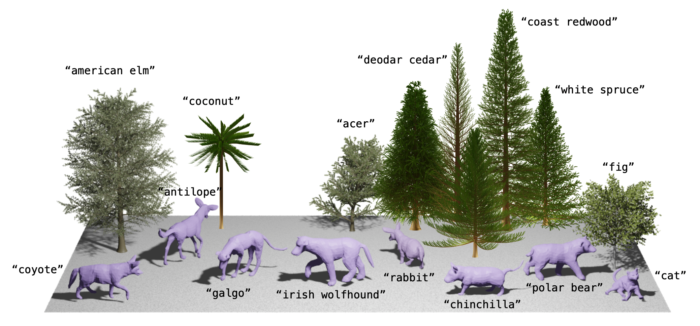

# AWOL

This repository contains the code for the method described in the paper : _AWOL: Analysis WithOut synthesis using Language_, by Silvia Zuffi and Michael J. Black, ECCV 2024.



## Installation
Create an environment and install the required packages:

```
python3 -m venv .awol_venv
source .awol_venv/bin/activate
pip install -U pip
pip install open_clip_torch
pip install absl-py
```

Clone the repository.
Register on the [project website](https://awol.is.tue.mpg.de).

Download the animal model ('smal_plus.pkl' and 'smal_plus_data.pkl') and place it in the folder
```
awol/awol/data/animal/
```
Download the checkpoints and place them in the folder
```
/awol/awol/code/cachedir/snapshots/
```
Each checkpoint should be placed in the corresponding directory removing the directory name from the file name. For example, the checkpoint 'submission_animal_realnvp_mask_pred_net_6000.pth' should be placed into 'submission_animal_realnvp_mask' with the name 'pred_net_6000.pth'.

## Running the code
To retrain the model, form the 'awol' directory:
```
./train.sh
```
To run the prediction from text or images:
```
./predict.sh
```
The CLIP encodings for the text are precomputed in the directory 'awol/code/data'

## Generating animals and trees from the results

To generate the animals and trees from the predicted shape parameters, run the code in the directory 'generate_trees"and_animals'. 
Note that to generate the trees you need Blender with the tree-gen add on (https://github.com/friggog/tree-gen)

Thanks to Peter Kulits (https://kulits.github.io/) for the ```inference.ipynb``` code.

## Citation

If you found the model or any of the pieces of code useful in this repo, please cite the paper:

```
@conference{zuffi_eccv2024_awol,
  title = {AWOL: Analysis WithOut synthesis using Language},
  author = {Zuffi, Silvia and Black, Michael J.},
  booktitle = {European Conference on Computer Vision (ECCV)},
  month = oct,
  year = {2024},
  doi = {},
  month_numeric = {10}
}
```
